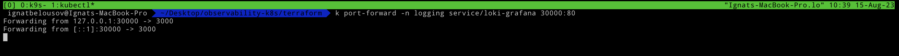
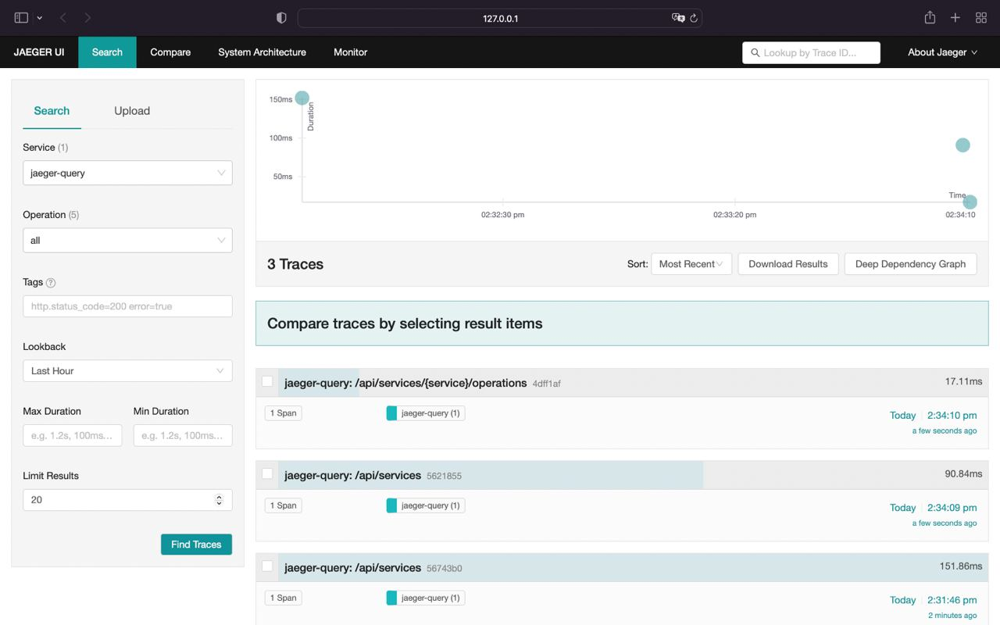

# Table of contents

- [Introduction](#introduction)
- [Requirments](#requirments)
- [Note](#note)
- [Implementation](#implementation)
  * [Logs](#logs)
    + [EFK stack](#efk-stack)
    + [PLG stack](#plg-stack)
    + [Bonus Loki & fluent-bit](#bonus)
  * [Metrics](#metrics)
    + [kube-prometheus-stack](#kube-prometheus-stack)
    + [prometheus-community/prometheus](#prometheus-community)
  * [Traces](#traces)
    + [Jaeger](#jaeger)

# Introduction

The kubernetes observability consists of 3 main *pillars*:
- Logs
- Metrics 
- Traces

**Logs** are used for providing a record of events and activities within the system, such as application logs, system logs, and network logs

**Metrics** are used for providing a quantitative measurement of various aspects of the system, such as resource utilization, system performance, and application behavior.

**Traces** are used for providing visibility into the flow of requests and the dependencies between different components in a system. Tracing helps to identify performance bottlenecks and diagnose issues.

The aim of observability is to solve customer issues quickly. Creating monitoring dashboards is useless if it can’t help engineering teams quickly identify the root causes of performance issues.

A modern distributed software system has a lot of moving components. So while setting up monitoring, you might not know what answers you would need to solve an issue.

Observability enables application owners to get answers to any question that might arise while debugging application issues.

<div align="center">
    
</div>


# Requirments

- Kubernetes cluster
- kubectl
- helm
- Public / Private cloud
- Elastic Cloud
- Terraform

# Note 

In order this example to work you need `kubernetes` cluster up and running. In order to create it go to the terraform folder and apply all the files

```bash
terraform init 
terraform apply
```

For obtaining yandex kubernetes config execute the following command

```bash
yc managed-kubernetes cluster get-credentials observability-k8s --external
```

# Implementation

## Logs

[Back to top](#)

For setting up classical logs processing we need the following components:
- Log shipper
- Log aggregation system
- Data visualization tool

There are 2 main stacks right now for implementing `Kubernetes` logging: EFK and PLG. In this setup I'll show both of them, if you need more info about particular stack I suggest this [comparison](https://www.infracloud.io/blogs/logging-in-kubernetes-efk-vs-plg-stack/)

### EFK stack

[Back to top](#)

- Fluent-bit - log shipper
- ElasticSearch - log aggregation system
- Kibana - data visualization tool

*NOTE: in this setup I'll be using `elastic cloud` so you need to have an elastic cloud account to follow along*

Don't forget to add a `fluent` helm repository

```bash
helm repo add fluent https://fluent.github.io/helm-charts
helm repo update
```

Before we jump into `fluent-bit` setup you need to obtain elastic cloud credentials. After your elastic deploy was created click `Manage` button and grab `cloud-id` and `host` (near elasticsearch instance, button `Copy endpoint`). Cloud auth it's a credentials from elasticsearch when cloud was originally created (csv file) separated with `:` (e. g. `deployname:secret`)


Example fluent-bit config for elastic cloud should be like this (you can find it inside `helm-values` folder). Fill it with your credentials and proceed to th next step


Now we can deploy our fluent-bit into the cluster with helm

```bash
helm install -n logging --create-namespace --values ./helm-values/fluent-bit-values.yaml fluent-bit fluent/fluent-bit
```


If we inspect `fluent-bit` logs, we should be able to see that `fluent-bit` already started some fs readers


And successfully dilivered logs to elastic cloud


Alright let's have a little demo. We're about deploy a sample perl pi job from official kubernetes docs, and deliver it's logs to the elastic cloud

Deploy a sample pi job

```bash
kubectl apply -f https://kubernetes.io/examples/controllers/job.yaml
```


Let's again inspect `fluent-bit` logs


`fluent-bit` already pick up our pi container logs and started another reader with id `16`

After a little while logs will be delivered to the elastic cloud


### PLG stack

[Back to top](#)

- promtail - log shipper
- Loki - log aggregation system
- Grafana - data visualization tool

Don't forget to add a `grafana` helm repository

```bash
helm repo add grafana https://grafana.github.io/helm-charts
helm repo update
```

For installing `Loki` we can use `loki-stack` helm chart from grafana repository

```bash
helm install -n logging --create-namespace loki grafana/loki-stack --set grafana.enabled=true
```


After loki is up and running we can access grafana by doing port-forward

```bash
kubectl port-forward -n logging service/loki-grafana 30000:80
```



In order for obtaining grafana `admin-password` execute the following command

```bash
kubectl get secret -n logging loki-grafana -o jsonpath="{.data.admin-password}" | base64 --decode; echo
```


After success login to grafana go to the **Explore > Loki** and in field type `{container="loki"}` and then press `Run query` button.


Alright loki up and running. Let's repeat our demo from `EFK` stack

Deploy pi job

```bash
kubectl apply -f https://kubernetes.io/examples/controllers/job.yaml
```


And if we execute `{job="default/pi"}` we can see that loki shipped logs from pi job successfully


### Bonus

[Back to top](#)

Repeat the steps from `EFK` repository and upgrade loki helm release using this command

```bash
helm upgrade -n logging loki grafana/loki --set grafana.enabled=true,fluent-bit.enabled=true,promtail.enabled=false
```

Now we disable promtail and enable fluent-bit collector. After a little while we have `fluent-bit` and `Loki` up and running in the cluster


*Optional: update fluent-bit index to the `fluent_bit_kubernetes_logs` and upgrade it using command down below*

```bash
helm upgrade -n logging --values ./helm-values/fluent-bit-values.yaml fluent-bit fluent/fluent-bit
```

Now let's query our `Elastic Cloud` and `Loki`


## Metrics

[Back to top](#)

For setting up classical metrics monitoring we need the following components:
- Prometheus
- Grafana 
- Alertmanager
- Exporters (node-exporter, kube-state-metrics, etc.)

In this guide I'll cover 2 ways to setup metrics in k8s:
- [kube-prometheus-stack](https://artifacthub.io/packages/helm/prometheus-community/kube-prometheus-stack)
- [prometheus-community/prometheus](https://artifacthub.io/packages/helm/prometheus-community/prometheus)

*NOTE: For both methods you need to add `prometheus-community` helm repository*

```bash
helm repo add prometheus-community https://prometheus-community.github.io/helm-charts
helm repo update
```

### kube-prometheus-stack

[Back to top](#)

By default besides `Prometheus` kube-prometheus-stack chart installs additional, dependent charts:
- prometheus-community/kube-state-metrics
- prometheus-community/prometheus-node-exporter
- prometheus-community/alertmanager
- prometheus-community/pushgateway
- grafana/grafana

For installing `kube-prometheus-stack` run the the following command:
```bash
helm install prometheus-commnunity -n monitoring --create-namespace prometheus-community/kube-prometheus-stack
```

The output should be like this:


List of availiable svc


Now we can port-forward to grafana using `kubectl`
```bash
kubectl port-forward -n monitoring service/prometheus-commnunity-grafana 30000:80
```


After that we can go to the `http://localhost:30000` and see grafana up and running


The `prometheus-community/grafana` secret contains some fields that we need to decode with following commands


```bash
kubectl get secret prometheus-commnunity-grafana -n monitoring -o jsonpath={".data.admin-user"} | base64 --decode; echo
kubectl get secret prometheus-commnunity-grafana -n monitoring -o jsonpath={".data.admin-password"} | base64 --decode; echo
```

Nice! Now we're successfully logged in and can see the grafana main page


By default `kube-prometheus-stack` provides a ton of predefined grafana dashboards (**Home > Dashboards**)


For example let's inspect `Kubernetes / API server` group


For more info and availiable options you can visit `kube-prometheus-stack` artifacthub [here](https://artifacthub.io/packages/helm/prometheus-community/kube-prometheus-stack)

### prometheus-community

[Back to top](#)

By default besides `Prometheus` prometheus-community/prometheus chart installs additional, dependent charts:
- prometheus-community/kube-state-metrics
- prometheus-community/prometheus-node-exporter
- prometheus-community/alertmanager
- prometheus-community/pushgateway

*The installation of `prometheus-community/prometheus` almost the same but we need to **install grafana separately***

Grafana helm repo

```bash
helm repo add grafana https://grafana.github.io/helm-charts
```
For installing prometheus community execute the following commands:


For accessing prometheus ui we can do port-forward like this

```bash
kubectl port-forward -n monitoring service/prometheus-server 30000:80
```


And then access prometheus on `http://localhost:30000`


The next step is to install grafana from grafana/grafana repo (*NOTE: execute the `kubectl get secret` as shown in grafana output for obtaining admin passoword*)

```bash
helm install -n monitoring grafana grafana/grafana
```


And do port-forward

```bash
kubectl port-forward -n monitoring service/grafana 30000:80
```

After port-forwarding by entering `http://localhost:30000` we can see grafana login screen 


In order to create new datasource and add dashboards follow this steps:

1. Go to the **Home > Connections > Type `prometheus` and select it**


2. Click `Create a Prometheus datasource`


3. Configure Prometheus datasource

In host field enter your local k8s cluster dns for prometheus (e. g. http://prometheus-server.monitoring.svc.cluster.local)


4. Scroll all the way down and click `Save & test`


5. Go to the **Home > Dashboards** and click **New > Dashboards**


6. Select `Prometheus` data source


7. Configure dashboard by selecting metric type and chart type


8. Save it


That's all, now we have prometheus / grafana up and running inside a kubernetes envirement.

***This chart isn't contains grafana and ton of grafana dashboards as `kube-prometheus-stack` do, but still it's an a good option***

## Traces

[Back to top](#)

Add `jaeger` helm repository:

```bash
helm repo add jaegertracing https://jaegertracing.github.io/helm-charts
```

### Jaeger

[Back to top](#)

For tracing setup I'll be using `jaeger` as trace exporter. All availiable exporters and also docs for `OpenTelemetry` you can find [here](https://opentelemetry.io/docs/instrumentation/js/exporters/).

***NOTE: Jaeger has 2 main data stores `ElasticSearch` and `Cassandra` (default). You can use either Cassandra or ElasticSearch data store. In this setup I'll be using `Cassandra` as main data store. For more info see: https://artifacthub.io/packages/helm/jaegertracing/jaeger#installing-the-chart-using-a-new-elasticsearch-cluster***

For installing `jaeger` run the following command:

```bash
helm install jaeger jaegertracing/jaeger
```


After a little while all pods should be up and running


For accessing `jaeger` ui do port-forward by executing commands down below

```bash
export POD_NAME=$(kubectl get pods --namespace default -l "app.kubernetes.io/instance=jaeger,app.kubernetes.io/component=query" -o jsonpath="{.items[0].metadata.name}")
kubectl port-forward --namespace default $POD_NAME 8080:16686 1>/dev/null &
```

Now you can access `jaeger` ui on `localhost:8080`



For example application we deploy my demo python app. Clone it and apply all manifests using `Kustomize`

```bash
git clone https://github.com/fayvori/python-otel-demo.git
cd python-otel-demo
kubectl create namespace otel-demo
kubectl apply -n otel-demo -k manifests
```

This is simple flask application which is returned dice roll on path `/rolldice`. We also port-forward it to our local host

```bash
kubectl port-forward -n otel-demo svc/flask-otel-service 5000:5000 2>/dev/null &
```


Go to `localhost:5050/rolldice` and refresh page couple times. Also we can simulate timeouts by providing `?sleep` argument. (e.g. `localhost:5050/rolldice?sleep={duration}`, default is 0)

Return to `jaeger` ui and select `python.dice` in `Service` field and `do_roll` in `Operation` field


Our traces successfully dilivered to the `Jaeger`.

**Don't forget to kill all the background jobs when you're done**

```bash
kill %1
kill %2
```